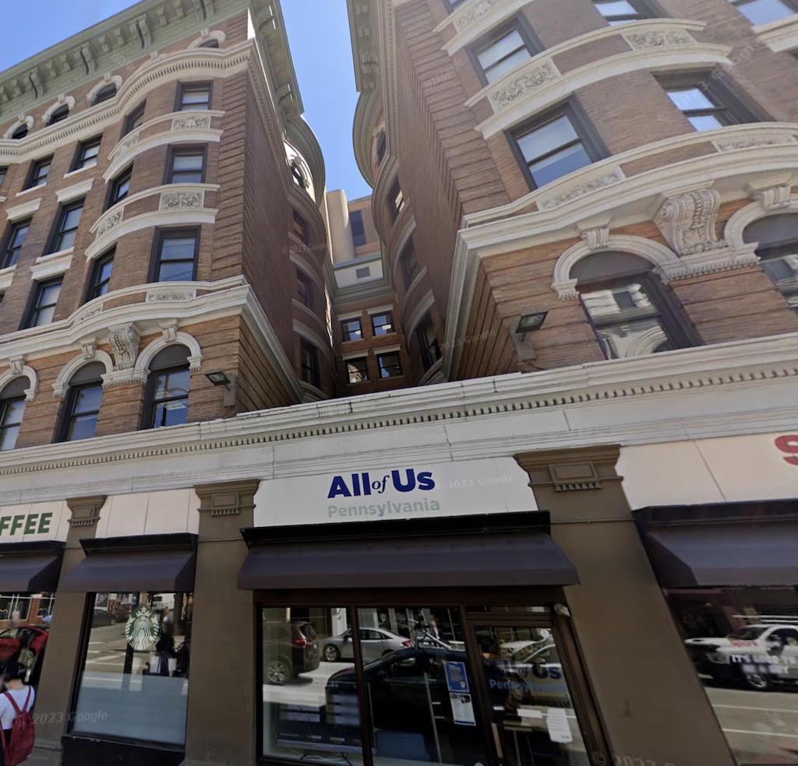
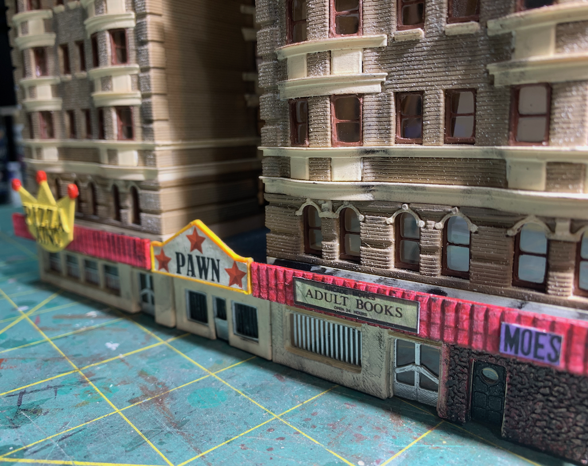
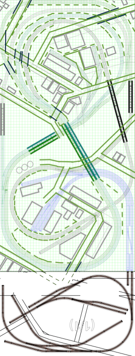
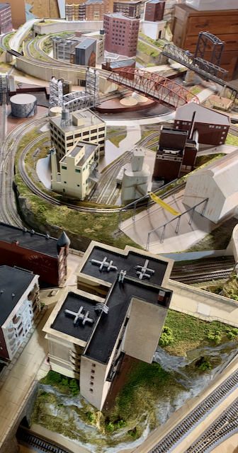
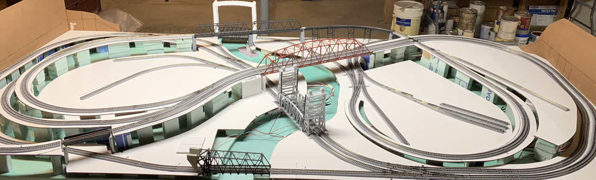

# [Wiki Page](https://github.com/nscale4by8/nscaleClevelandFlats/wiki)

The Wiki Page is a space for running comentary, documentation updates, announcements, and random thoughts. [The Wiki Page tends to be updated more often that the main web page. (click for more)](https://github.com/nscale4by8/nscaleClevelandFlats/wiki)

# [Structures](structures/structures.md) 
[(click for more)](structures/structures.md)

Prototype                           |   Model                   
:----------------------------------:|:----------------------------------:
  |  |
[Forbes Ave. Today](structures/buildingForbes/buildingForbes.md) | [1970s Forbes Ave.](structures/buildingForbes/buildingForbes.md)

# [Cuyahoga River Lift Bridges](./liftbridges/liftbridges.md) 
[(click for more)](./liftbridges/liftbridges.md)

Prototype                           |   Model                   
:----------------------------------:|:----------------------------------:
  |  | 
[The Flats Industrial Railroad lift bridge over the Cuyahoga river: CCC BY-SA 3.0](https://upload.wikimedia.org/wikipedia/commons/thumb/3/36/Flats_Industrial_Railroad.jpg/640px-Flats_Industrial_Railroad.jpg) | [More Information](./liftbridges/liftbridges.md)

# [Track Plan](trackPlan/trackPlan.md) 
[(click for more)](trackPlan/trackPlan.md)

Plan                                |   Overview                   
:----------------------------------:|:----------------------------------:
  |  | 
[Plan Including Annex](trackPlan/trackPlan.md) | [Annex in Foreground](trackPlan/trackPlan.md)

# [Benchwork](benchwork/benchwork.md)
[(click for more)](benchwork/benchwork.md)

# [Electronics](controls/controls.md)
[(click for more)](controls/controls.md)

# [Presentation About 3D Printing](3DPrintingForModelRailroading.key.pdf)
