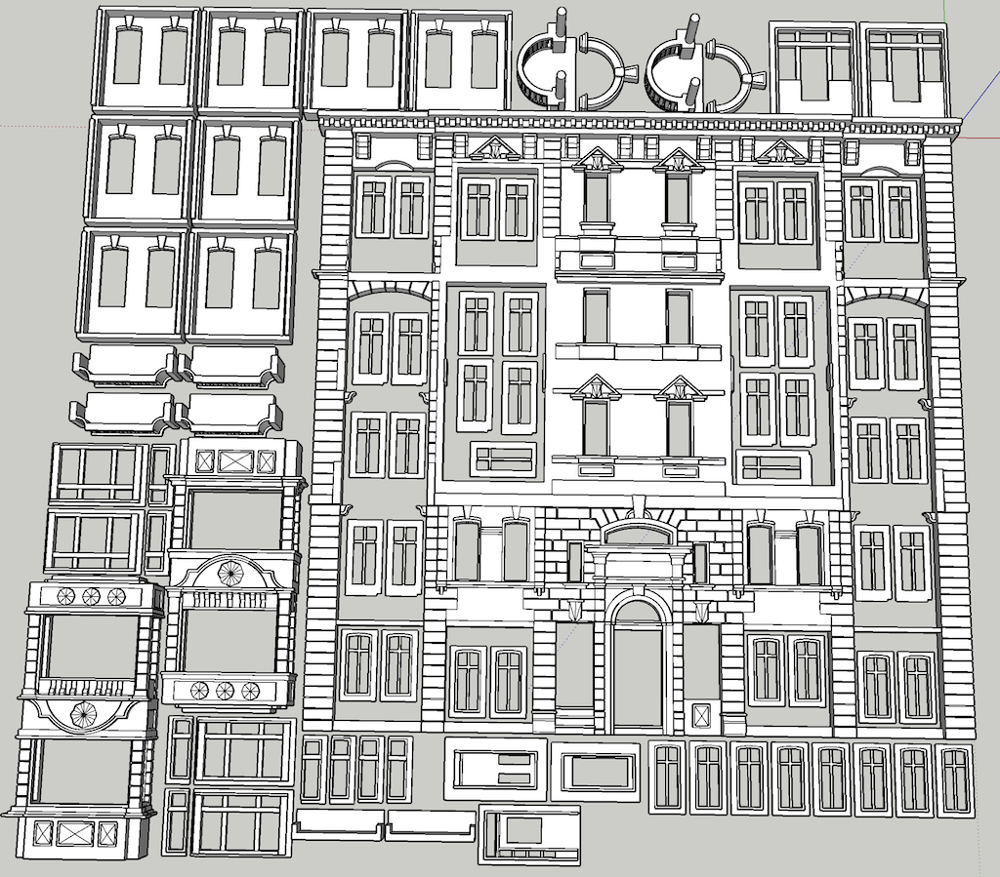
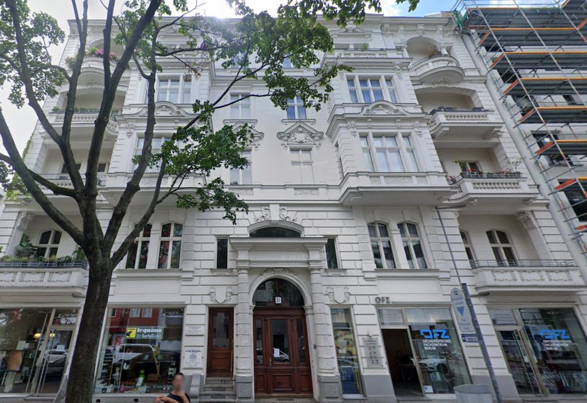

[Back](../structures.md)

# 21 Augsburger 

On a trip to Berlin, a walk near the Zoo S-Bahn station delivered me to a neighborhood of stunning buildings. Some are hundreds of years old, and others are new but constructed to match the neighbors.

The following image shows a test fit of printed and painted parts prior to gluing.

[Back](../structures.md)
