[Back](../structures.md)

# Halle's Department Store Building 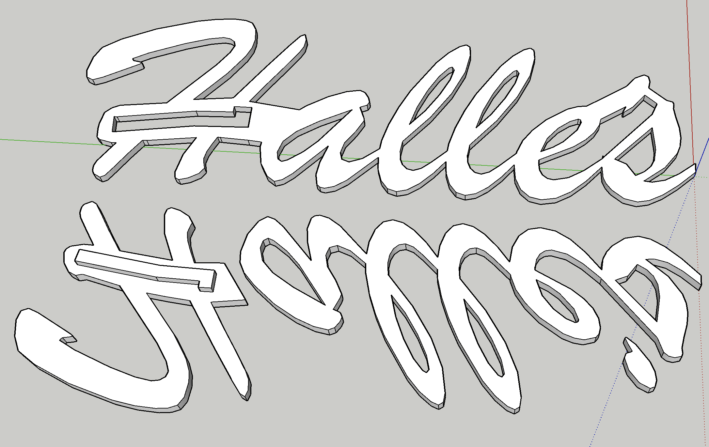

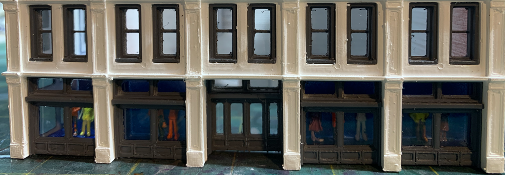

Halle's Department Stores were a Cleveland, OH, chain with its flagship store on Playhouse Square in down town Cleveland. The store was founded in the late 1800s and had a good run. The final store closed in 1982 due to the deep recession at the time, competition from suburban malls, and the decay of the rapid transit system that formerly ferried its remaining clientele from the inner neighborhoods.

I model the 1970s industrial flats of Cleveland when heavy industry still churned, the river still burned, and the down town was slightly less decrepit than a war zone. I designed, 3-D printed, painted, and assembled my selectively compressed version of the Halle's building for use as a backdrop for industrial railroad operations.

Built Model                         |   Prototype                   
:----------------------------------:|:----------------------------------:
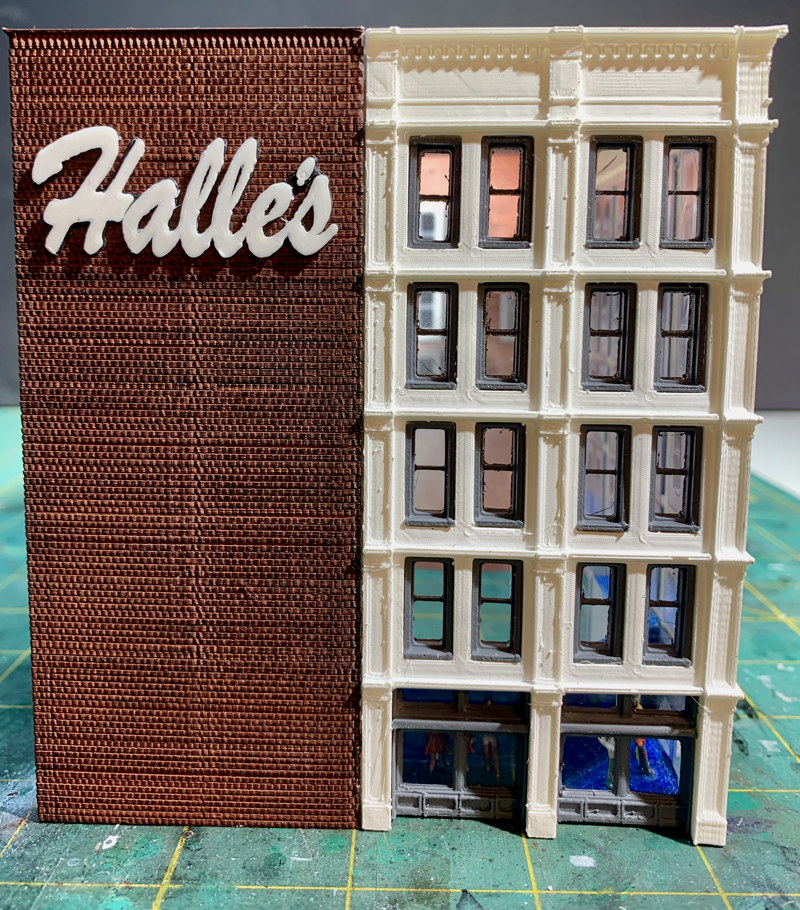|  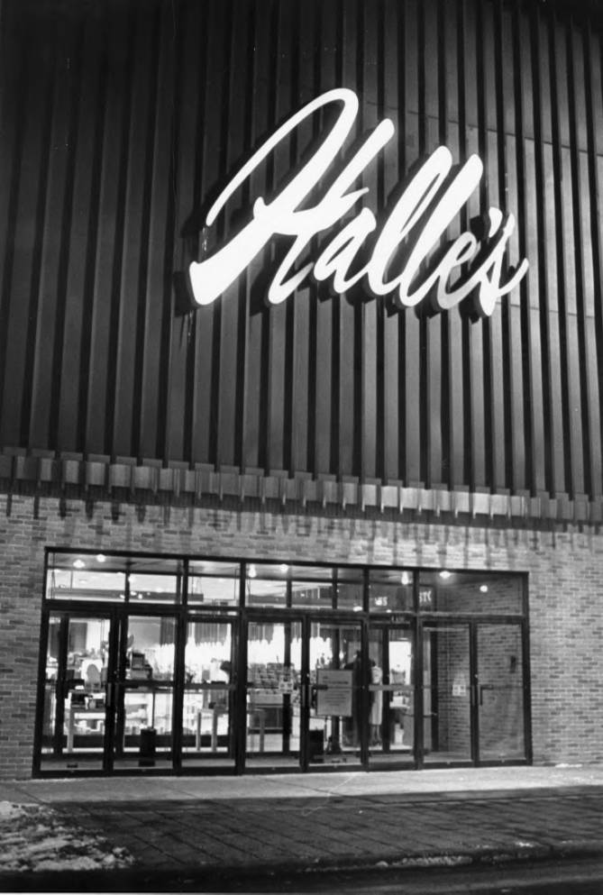 
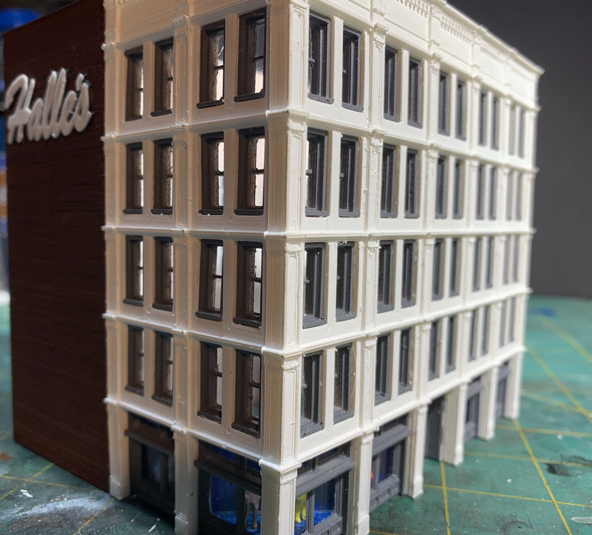|  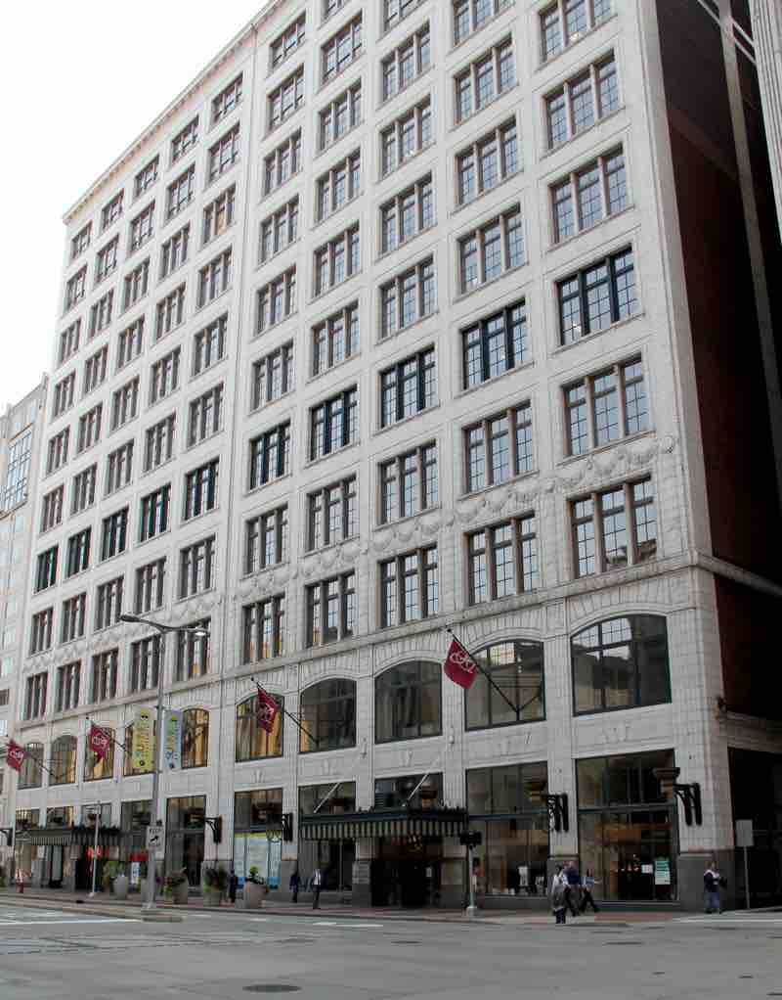 

## 3-D Models

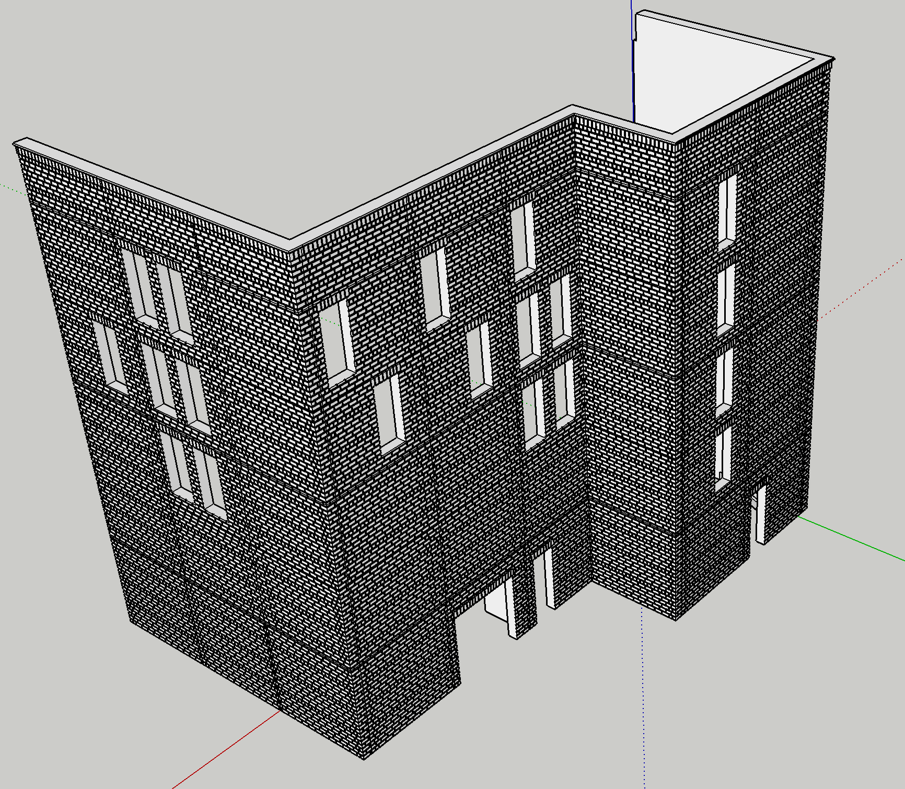
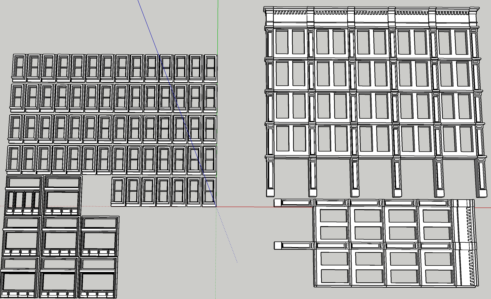

## Other Details 

Built Model Details                 |   Built ModelDetails                   
:----------------------------------:|:----------------------------------:
              |  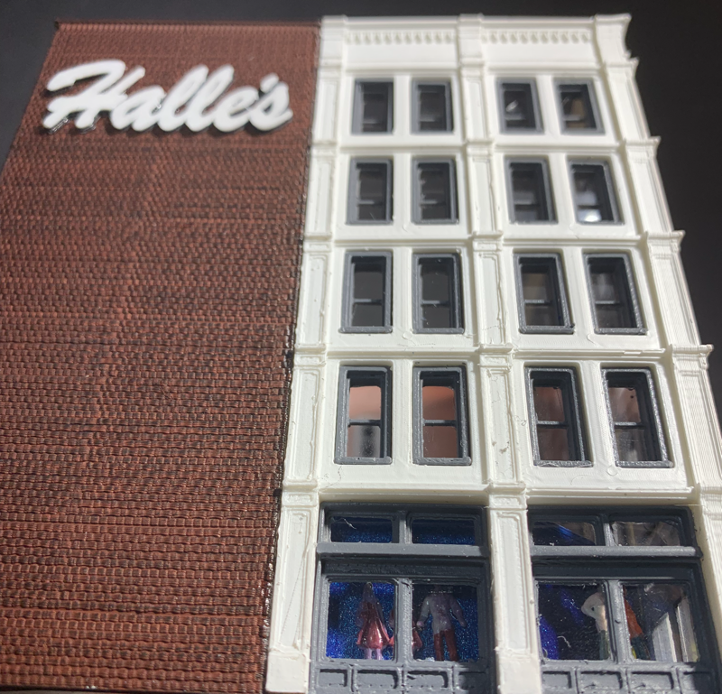 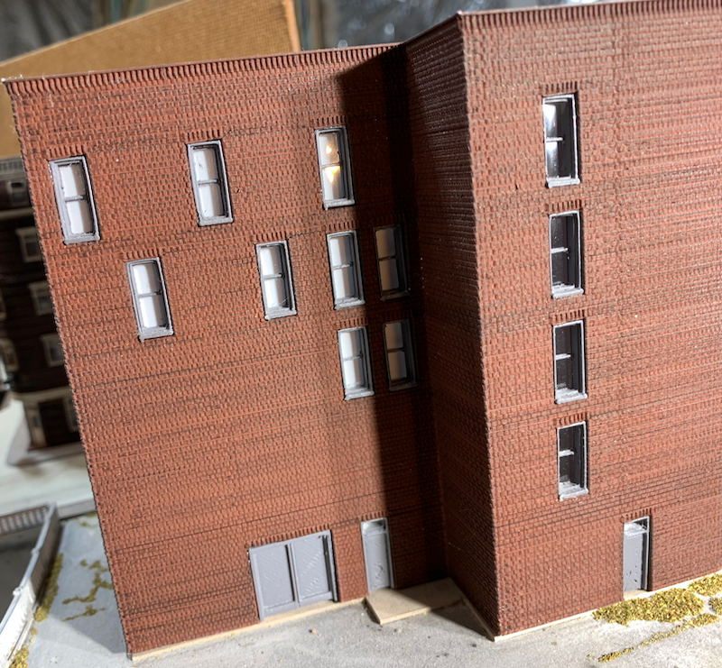           |

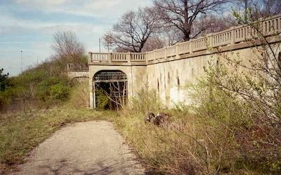

[Back](../structures.md)
