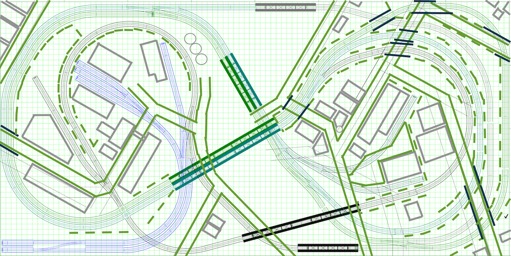

[Back](../index.md)

## Track Plan

The plan is inspired by the famous [Atlas Granite Gorge & Northern](https://www.modeltrainforum.com/picture.php?albumid=241&pictureid=2492). 
 
The adapted plan can be configured as a double track figure eight with two trains running in opposite directions.
- The adapted plan enables local switching operations on sidings while other trains run continuously.
- The adapted plan can be configured as a twisted dog-bone that crosses the river six times before traveling over the same segment of rail twice.
- The adapted plan provides two variants of out-and-back originating either direction from the industries along the river.
 

[High Resolution Plan](Rev8Blocks.pdf)

[Back](../index.md)

