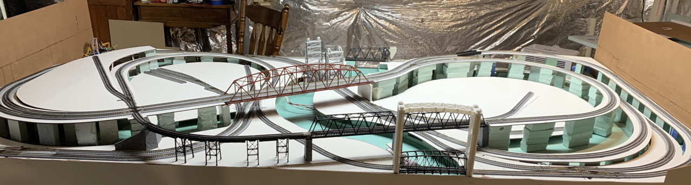
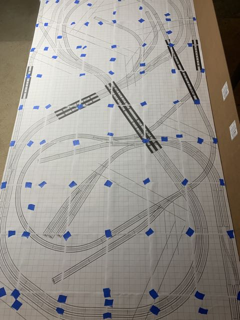
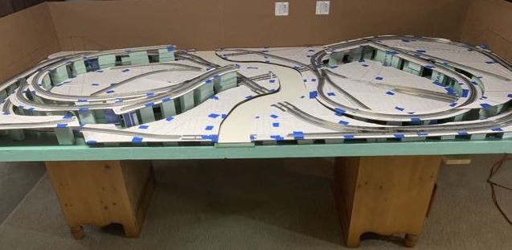
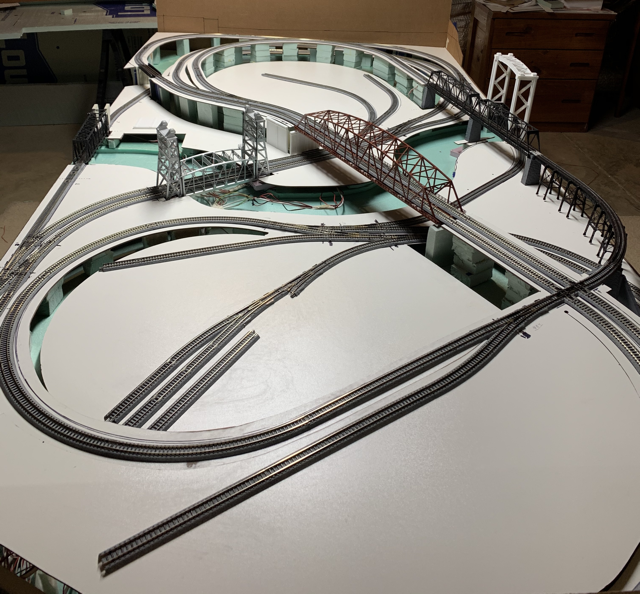
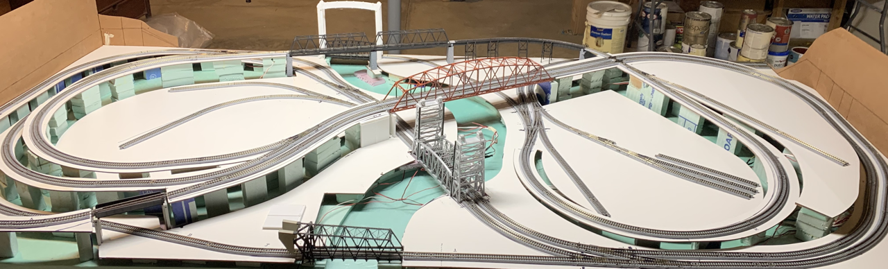
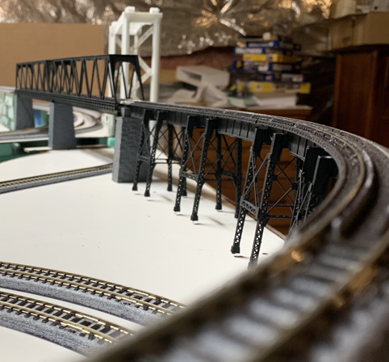
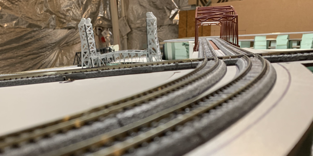
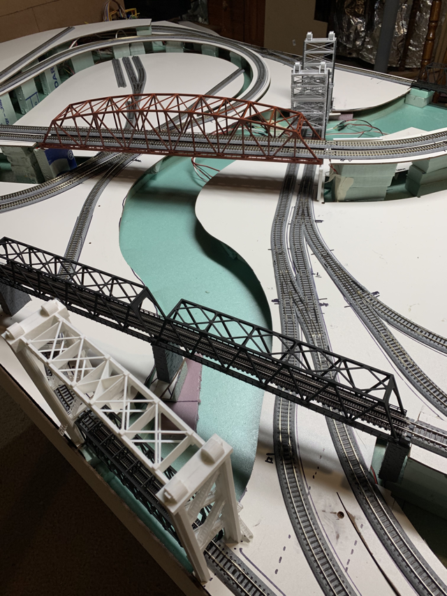

[Back](../index.md)

# Benchwork and Test Fit
The benchwork is shown dry-fit. Nothing is glued down. All of the wiring is in place for four separate electrical blocks. All turnouts are remotely operated by the [Control System](../controls/Control.md). I tested the layout for a while to assure reliable operation because once the benchwork is glued, it is very difficult to modify wiring.

The benchwork consists of 1x2 dimensional lumber covered with 2 inch medium density foam. Then another quarter inch of foam covers everywhere except the river. Channels are cut in the quarter inch foam to provide routing for bundles of wires. On top of the quarter inch layer, one inch foam "feet" support the lowest track elevations. Feet of various lengths create grades and elevated sections. Pre-primed Masonite rests atop the foam feet. Track will eventually be glued to the Masonite.

## The Hardness of Masonite
I like the hardness masonite. I haven't noticed any problems with it being too hard. I like that it cuts cleanly with a saber-saw and produces clean drill holes. By glueing the Kato track segments rather than nailing, I avoid the traditional problem that it is difficult to hammer thin spikes into Masonite.

The track plan is drawn in XtraCAD and then printed full size. The pages are aligned and taped to each other but not to the underlying masonite.

The masonite is cut with a saber-saw, and medium density styrofoam is used to produce elevated sections and grades.

I designed lift bridges in SketchUp and Blender. In most cases, I had to make several test prints and minor changes to 3D models before everything worked right. The unpainted modern lift bridge on the right side of the photo is so-far the only time one of my models has printed just right on the first try. The bridges are designed to fit the track plan with tight tolerances. It was necessary to test fit everything full-sized on the cut masonite. There weren't any significant problems with the elevations or fit. I attribute the success to using full size CAD drawings and the fact that 3D printers produce dimensionally accurate results. In my limited experience, if I had scratch built the bridges from styrene or wood, there would have been endless tweaking and adjusting to get the right fit.

The bridge ties are 3D printed in the largest curved sections my printer can produce.  Tie guide rails, plates and spikes are part of the printed model with tolerances so tight that the rails require light force slide into place. Once the rails are in, a couple of spots of super glue on the outsides of the rails fix them permanently in place. 3D printing is able to produce the correct gauge every time. The result is solid. 

The red bridge is a standard Tomix product that is 22 inches long. I may eventually replace it with a 3D printed concrete arch bridge, but It works well for now.

# 2024 Annex

As of mid-2024, a dearth of space for more 3D printed structures on the main 4'x8' NScale "Cleveland Flats Industrial Railroad" prompted construction of a annex. A second full 4'x8' bringing the total size to 4'x16' seemed over ambitious. Coincidentally, pent up desire to exhibit the layout(s) swelled. The 4'x8' was built to be light weight and could be taken to shows, but it would be quite a production. The best of all worlds in this case is a 4'x30" N-Track Module that attaches to the existing 4'x8' but can also be taken to shows and incorporated in modular layouts.
 

The layout represents the urban industrial squalor of the Cleveland Flats in the 1970s. A kindred spirit, David K. Smith, modeled the Jersey City Industrial Railroad and wrote, "Perhaps the documentation on this layout will inspire someone else to take it all the way to the finish line." Inspiration greatly influenced adaptation of David K. Smith's Jersey City Industrial Railroad plan for a slightly larger 4'x30" form factor and for integration with my existing layout.

I revised the plan slightly once I started test fitting track. I moved a couple of spurs and tightened the radius of a couple of short curve sections. Fortunately, I already had some spare curved sections of Kato Unitrack. The primary motivation is to align roads on the module with the roads on the adjacent layout. As a secondary benefit, an elevated road diagonally crossing the module will serve as a sight break enabling two separate vignettes and decreasing the perceived spaghetti-bowl character of the dense industrial spurs.

## First Structures

[Back](../index.md)
