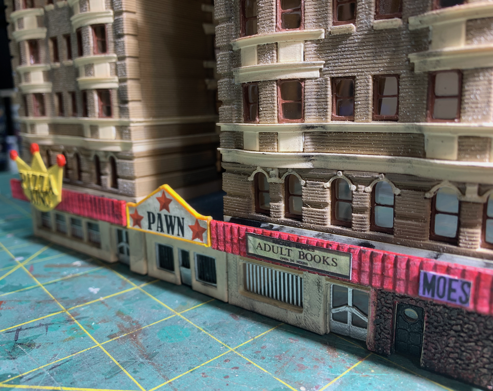
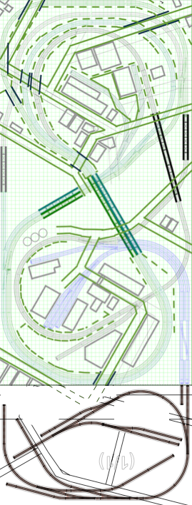
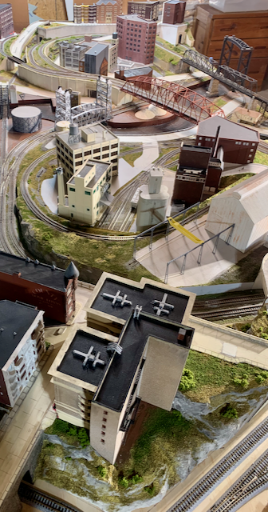

# [Structures](structures/structures.md) 
[(click for more)](structures/structures.md)

Prototype                           |   Model                   
:----------------------------------:|:----------------------------------:
  |  |
[Forbes Ave. Today](structures/building21Augsburger/building21Augsburger.md) | [1970s Forbes Ave.](structures/building21Augsburger/building21Augsburger.md)

# [Cuyahoga River Lift Bridges](./liftbridges/liftbridges.md) 
[(click for more)](./liftbridges/liftbridges.md)

Prototype                           |   Model                   
:----------------------------------:|:----------------------------------:
  |  | 
[The Flats Industrial Railroad lift bridge over the Cuyahoga river: CCC BY-SA 3.0](https://commons.wikimedia.org/wiki/User:Mr.Z-man) | [More Information](./liftbridges/liftbridges.md)

# [Track Plan](trackPlan/trackPlan.md) 
[(click for more)](trackPlan/trackPlan.md)

Plan                                |   Overview                   
:----------------------------------:|:----------------------------------:
  |  | 
Plan Including Annex | Annex in Foreground

# [Benchwork](benchwork/benchwork.md)
[(click for more)](benchwork/benchwork.md)

