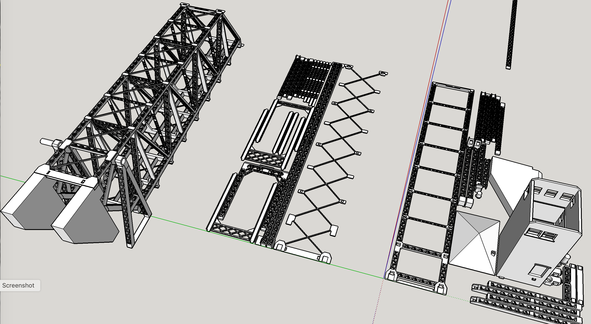
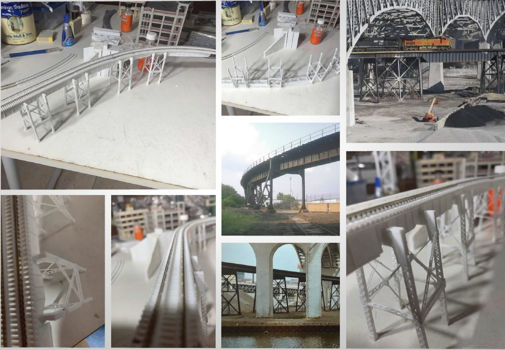
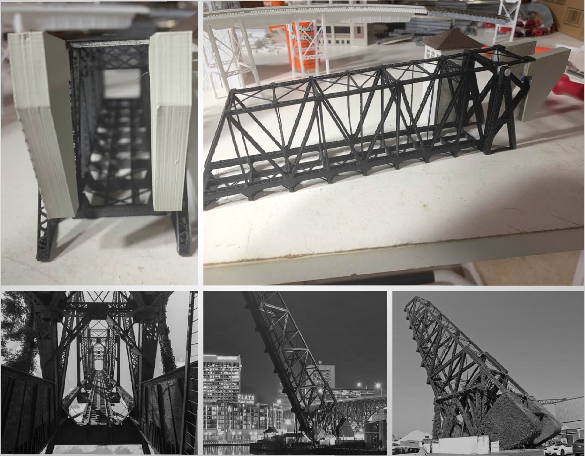
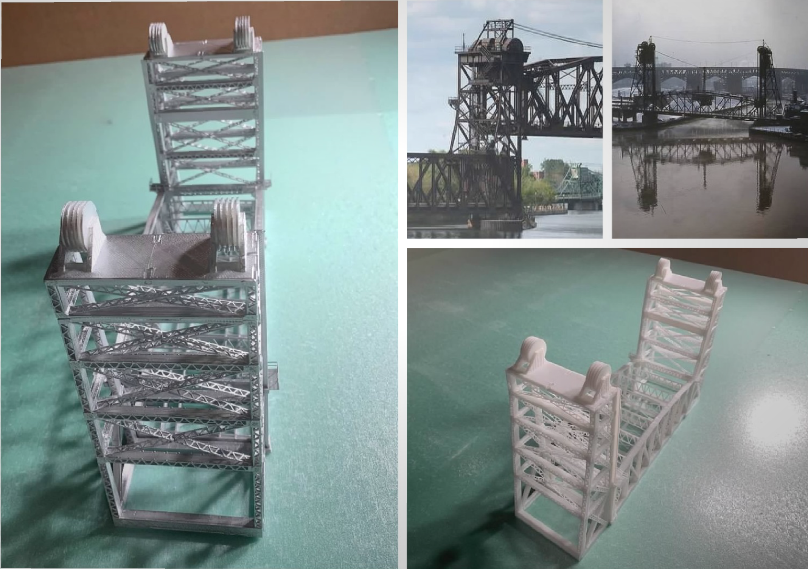
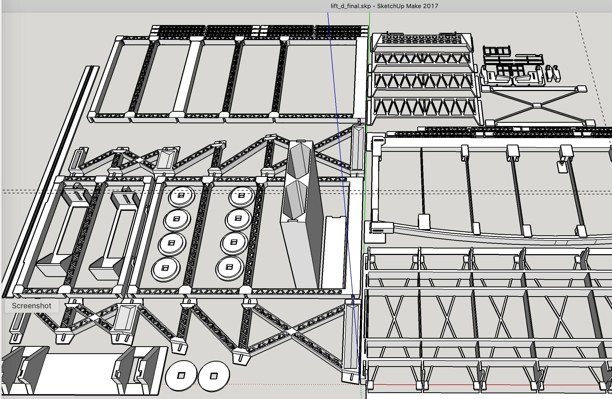
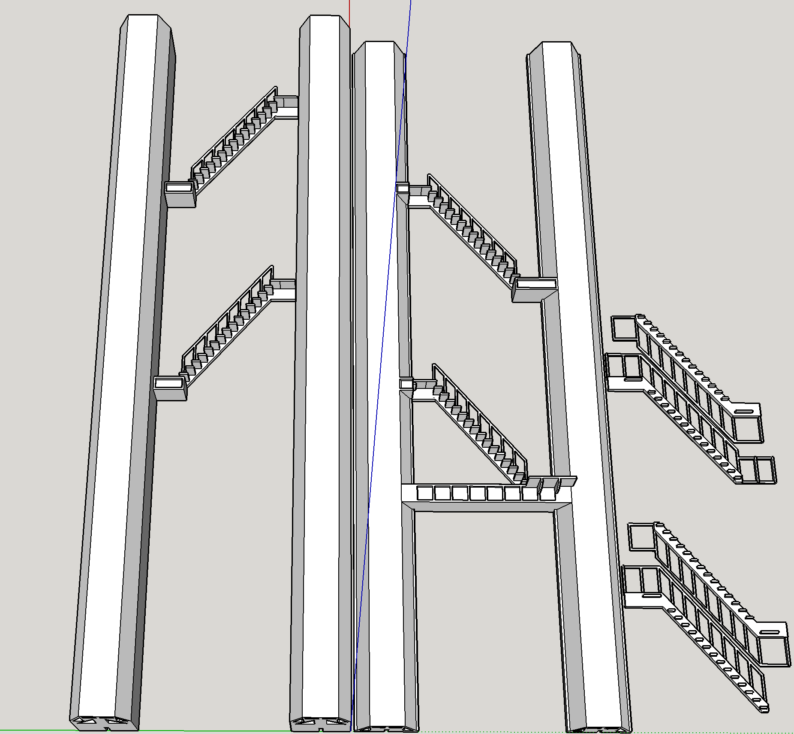
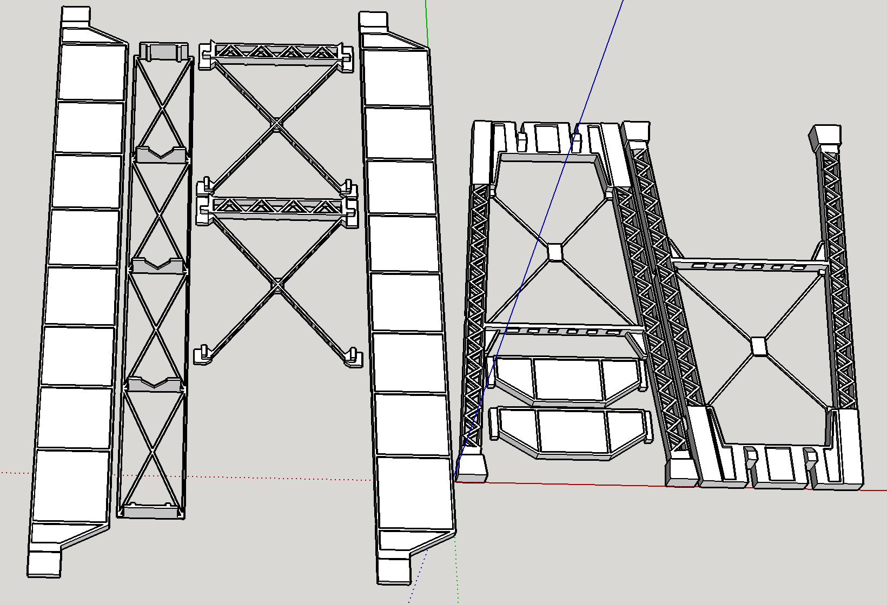
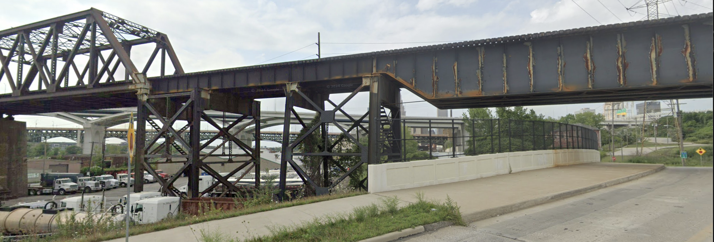

[Back](../index.md)

# Prototype Scenes (Lift Bridges)

Cuyahoga River Lift Bridge Number 3 
By <a href="https://commons.wikimedia.org/wiki/File:Cuyahoga_river_at_Cleveland.jpg">No machine-readable author provided. GandZ assumed (based on copyright claims).</a>, <a href="http://creativecommons.org/licenses/by-sa/3.0/">CC BY-SA 3.0</a>
 
Cuyahoga River Lift Bridge Number 4 By <a href="//commons.wikimedia.org/wiki/User:Mr.Z-man" title="User:Mr.Z-man">Mr.Z-man</a> - Own work, <a href="https://creativecommons.org/licenses/by-sa/3.0" title="Creative Commons Attribution-Share Alike 3.0">CC BY-SA 3.0</a>, <a href="https://commons.wikimedia.org/w/index.php?curid=136001827">Link</a>

Cuyahoga River Lift Bridges 2, 3, and 4 By Tim Evanson - https://www.flickr.com/photos/timevanson/20609077970/, CC BY-SA 2.0, https://commons.wikimedia.org/w/index.php?curid=80380424

Worlds Longest Shurzer Bascule Lift Bridge
Image By C Hanchey License: Creative Commons Attribution-NonCommercial (CC BY-NC)

# Modeled Lift Bridges (3D Printed)

The Cleveland Flats boast a myriad of lift bridges over the Cuyahoga River. All of my bridge models are originals. Prototype inspirations are provided side by side for comparison.

I printed the models myself using PLA plastic filament. I have a Bibo printer which I think is a generic version of some common design because there are many similar ones on the market.

The printer is advertised as capable of printing 0.4mm wide items and 0.05mm layer heights. When I first started, I used the highest resolution settings thinking they would produce the best results even though simple prints took many hours.

0.4mm corresponds to 2.4 inches in N-Scale. 0.05mm is 0.3 inches in N-Scale. Roughly speaking, the resolution is enough to print N-Scale hand rails, door knobs, ladders, etc., but it's a bit too thick for window mullions.

I discovered that 0.2mm layer heights work best with my printer. They produce the smoothest results. I also discovered that if the print head moves fast enough, it stretches the hot filament and can create thicknesses much less that 0.4mm. Consequently, I usually print with 0.2mm layer heights at about double the default speed. I can print details that are in the neighborhood of 1.4 or 2 scale inches. I typically print with finest details perpendicular to the base. In other words, I print the finest details in the width direction as opposed to the height direction.

I also printed bridge abutments modeling cut stone. The details are quite fine. There are no two stones that are exactly the same.

[Back](../index.md)
