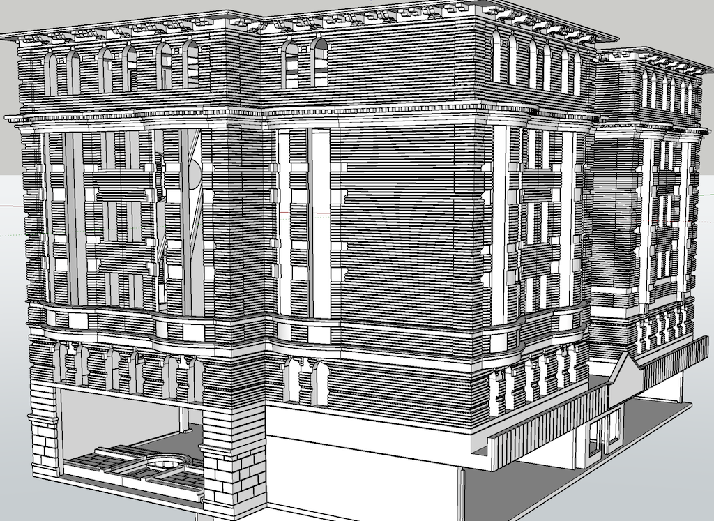

[Back](../structures.md)

# Forbes Building 

On a trip to Pittsburgh, PA., a walk along Forbes Ave. near the University of Pittsburgh campus provided many interesting architectural examples. Happily, the economy of that area is thriving. I'm forced to image how the same structures may have appeared in the bleak malaise of the 1970s.

[Back](../structures.md)
