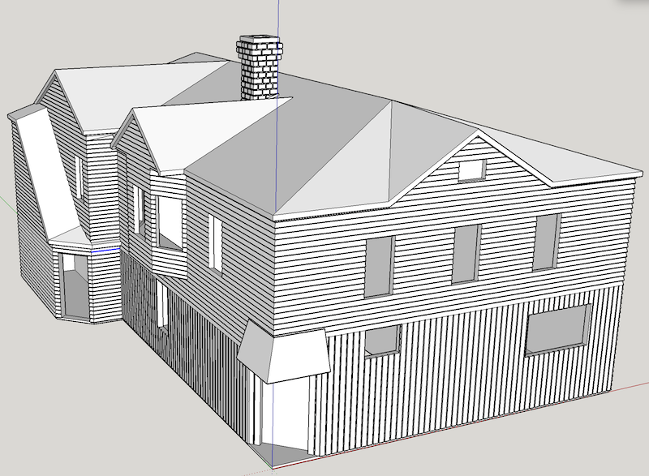
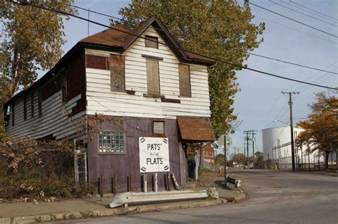
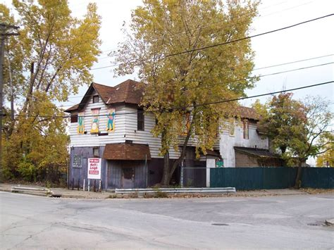
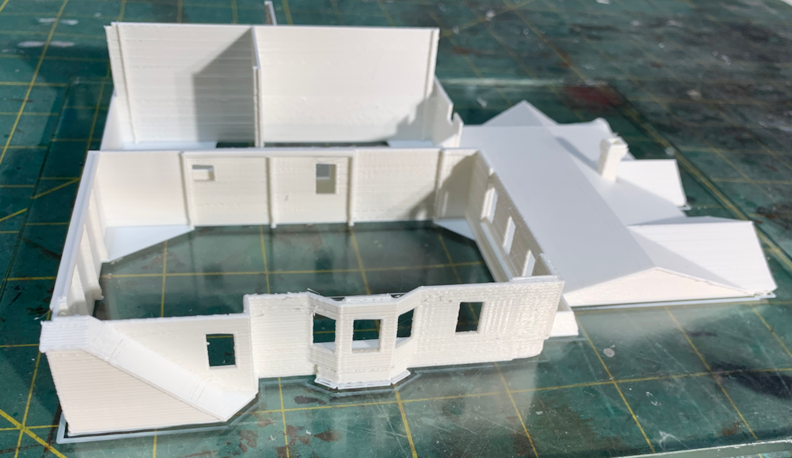
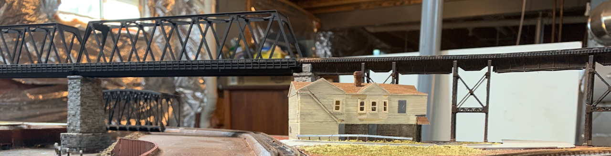

[Back](../structures.md)

# Pat's in the Flats

*Pat's in the Flats* was a famous dive bar in the Cleveland Flats Industrial District.

Even though the overall layout is a "Spaghetti Bowl" of track, I try to create recognizable vignettes.

## Free Models (download STLs) and Printing

[STL File Walls and Roof](CornerBarDilapidatedRevB.stl)
[STL File Windows and Doors](WindowsDoors.stl)

[Back](../structures.md)
