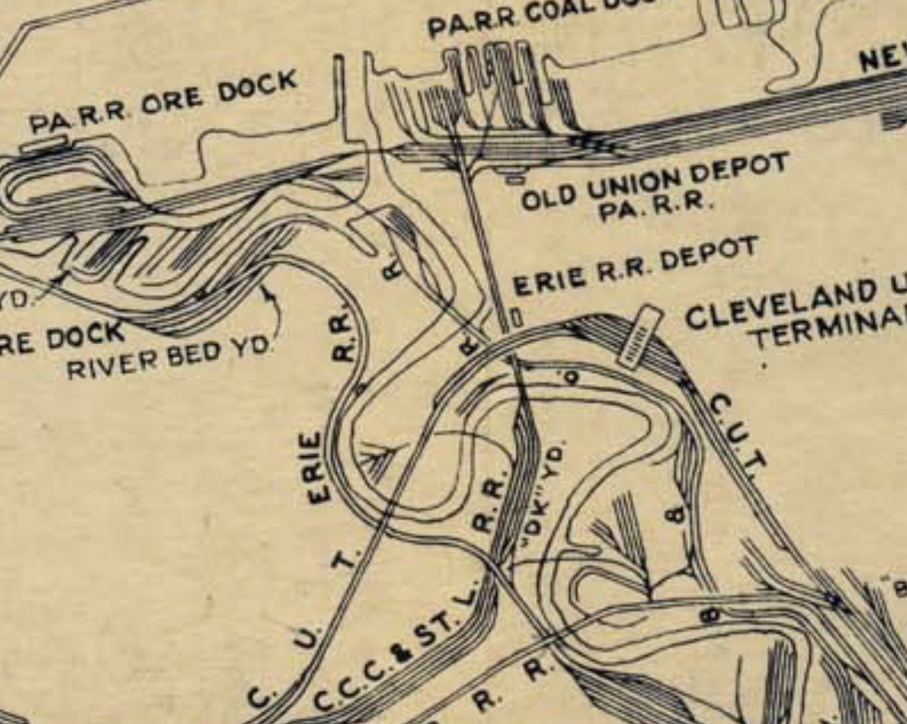
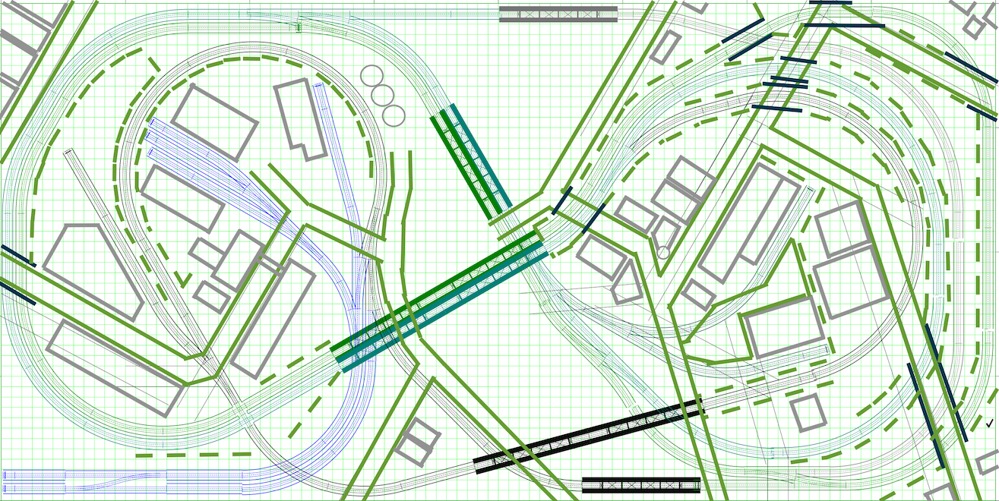

[Back](../index.md)

# Track Plan

The Cleveland Flats Industrial District was a spaghetti bowl of crisscrossing railroads at multiple elevations. There were at least eleven railroad lift bridges over the Cuyahoga River in Cleveland. There was even a high railroad bridge that crossed over a lower railroad bridge at a place where they both loomed above a road. Cleveland boasted 960 miles (1,540 km) of track within the city limits. Hundreds of industries were served. The railroads built dozens of interchange yards, classification yards, and storage yards. The big players, Baltimore & Ohio RR, Pennsylvania RR, Erie-Lackawanna RR, and New Your Central RR either shared right of way with smaller companies or squeezed routes into the limited spaces above, below, or between steel mills, deep river cuts, dense neighborhoods, and sheer cliff faces.

Railroad Map circa 1950

## The Heart At The Center

In the 1940s, all of the following railroads owned rails in Cleveland:

- Baltimore & Ohio (B&O)
- Pennsylvania
- Erie-Lackawanna
- New Your Central
- Lake Shore and Michigan Southern Railway
- Nickel Plate Road, (NYC & St.L), aka NKP, now Norfolk Southern
- Cleveland, Cincinnati, Chicago and St. Louis (C.C.C. & St. L), known as "The Big Four"
- Lake Erie and Western L.E. & W. - nicknamed "Leave Early and Walk"
- Cleveland and Mahoning Valley Railroad
- Cleveland Union Terminal Railroad (CUT)
- Newburgh & South Shore Railroad (N & SS)
- The Wheeling and Lake Erie (W. & L.E.)

By the 2000s, only Amtrak, Norfolk Southern, and the Wheeling and Lake Erie ran trains in or out of Cleveland. Amtrak only offered one train that departed at 2:00AM. Short Lines acquired some of the routes, and in a lot of cases, the lines were abandoned or removed.

The short lines that remain are

- Flats Industrial Railway Overview
- Cleveland Short Line Railway owned by CSX Transportation
- Cleveland Terminal and Valley Railroad interchanges with CSX
- Cleveland Works Railway operates a fleet of end-cab switchers

## A Plan That Captures The Essence

The plan is inspired by the famous [Atlas Granite Gorge & Northern](https://www.modeltrainforum.com/picture.php?albumid=241&pictureid=2492). 
 
The adapted plan can be configured as a double track figure eight with two trains running in opposite directions.
- The adapted plan enables local switching operations on sidings while other trains run continuously.
- The adapted plan can be configured as a twisted dog-bone that crosses the river six times before traveling over the same segment of rail twice.
- The adapted plan provides two variants of out-and-back originating either direction from the industries along the river.
 

[High Resolution Plan](Rev8Blocks.pdf)

[Back](../index.md)

